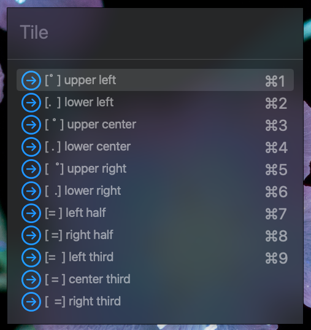

# Tiles.spoon

Spoon for Tiling your windows on a Mac using hotkeys

## Getting started

0. Get started with [Hammerspoon](https://www.hammerspoon.org). Follow the **Setup** section on [Getting Started with Hammerspoon](https://www.hammerspoon.org/go/) page.

1. Find your hammerspoon script directory. It will likely be `$HOME/.hammerspoon` after installation.

2. Download and save `Tiles.spoon` directory to: `{your-hammerspoon-path}/Spoons/Tiles.spoon`

3. In your `init.lua` file, you should import the spoon as follows:

```lua
hs.loadSpoon('Tiles')
```

Reload your hammerspoon config and you're ready to go 😎

## How to Use

Hold `ctrl opt cmd`, press `{key}` then choose the window position. *N* last focused windows will be resized and moved depending on the selected option.

| Key | Number of windows |
|:--------:|:--------------------:|
| w   | 1 |
| e   | 2 |
| q (wide) | 3 |


